# 한국어 장비 근거 데스크

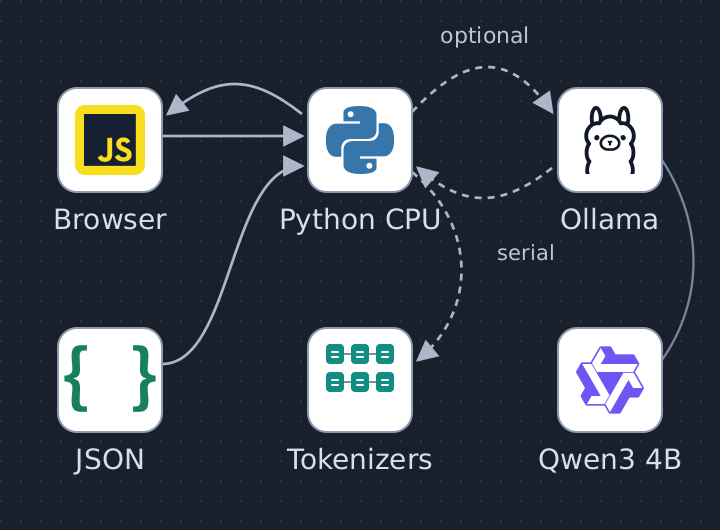

[편집 가능한 SVG](docs/architecture.svg) · [그림 출처와 라이선스](docs/architecture-provenance.md)

공개 KERI 미리보기 JSON과 브라우저 질의를 Python이 처리합니다. CPU 어휘 검색 또는 고정 순서 전체 원문을 선택하고, 선택적인 모델 분기는 CPU Tokenizers 사전계수와 공유 잠금 아래 직렬 Ollama/Qwen 요청을 거칩니다. 반환된 인용은 Python이 원문과 대조해 브라우저에 표시합니다.

한국전기연구원 공개 장비 목록에서 **후보 원문을 찾고, 모델명·수치 표기·공유범위의 근거를 확인하는** 작은 업무 데스크입니다. 연구개발·기술지원 담당자가 공개 목록을 읽고 제공기관에 추가 확인할 질문을 정리하는 흐름을 다룹니다. 현재 장비 예약이나 방문자 이용 권한을 결정하는 서비스는 아닙니다.

개발 질의에 대한 실제 Qwen 호출 14건을 실행했고 실패까지 보존했습니다. **동결 평가 12건의 결과는 아직 없습니다.** 이 README의 개발 결과를 모델 정확도나 업무 절감 효과로 해석하지 않습니다.

## 기업 업무와의 연결

[LS ELECTRIC 2025–2026 지속가능경영보고서](https://www.ls-electric.com/ko/company/data/2025_2026_LSELECTRIC_Sustainability_Report_ENG.pdf#page=11)의 인쇄 11쪽(PDF 인덱스 10)은 Solution Square가 기술 문서에 LLM/RAG를 활용하는 지능형 기술지원 플랫폼으로 발전하고 있으며, 24시간 지원 체계 구축과 다국어 서비스 확대를 추진한다고 설명합니다. 이는 **기업의 자체 보고이며, 발전·구축 중이라는 성숙도 표현**입니다. 독립적으로 확인된 검색 정확도나 운영 효과의 수치로 해석하지 않습니다.

그 공개 업무에서 “기술 자료를 찾고 답변 근거를 확인한다”는 흐름을 참고했습니다. 여기서 사용하는 자료는 LS 매뉴얼이나 고객 문서가 아니라 공개 KERI 장비 목록입니다. 기업의 내부 아키텍처, 호스팅 방식 또는 지원 품질을 이 구현으로 추정하지 않습니다. [Solution Square 포털](https://sol.ls-electric.com/kr/ko/main)은 참고 링크이며, 로그인 영역이나 동적 서비스 기능을 재현한 것은 아닙니다.

## 실제 원문과 재사용 범위

출처는 [공공데이터포털의 한국전기연구원 장비보유현황](https://www.data.go.kr/data/15018891/fileData.do)입니다. 카탈로그 기준일은 **2026-04-17**, 공개 화면을 수집한 시각은 **2026-09-30 12:18:08 UTC**입니다. 원 제공 페이지는 전체 641행을 안내하지만, 이번 프로젝트에는 화면에서 확보한 **50행 DOM 미리보기 텍스트**와 그중 고정한 **8행**만 있습니다. 원본 CSV 바이트나 전체 641행을 확보했다고 주장하지 않습니다.

| 구분 | 고정된 자료 | 용도 |
|---|---|---|
| 실험 A | 8개 원문행: 미리보기 행 35, 41, 42, 44, 45, 46, 47, 48 | 동일 범위에서 원문 조회·RAG·all-context 비교 |
| 실험 B | 별도 50개 미리보기 원문행 | 검색 방해 후보를 포함한 retrieval-only 평가 |
| 원문 ID | 카탈로그 날짜와 미리보기 행을 식별하는 document ID | 이 스냅샷의 출처 식별; 물리 장비 고유 ID가 아님 |

제공 페이지의 재사용 표기는 **“이용허락범위 제한 없음”**입니다. 발행기관·출처·기준일·수집방식·권리 고지를 [source-rights.json](data/source-rights.json)에 보존했습니다. 이 고지는 별도 제조사 매뉴얼, 사진, 상표나 소프트웨어의 사용 허락을 뜻하지 않습니다. 이 저장소는 기업 보고서 본문·사진이나 제조사 매뉴얼을 재배포하지 않습니다.

제공기관은 활용범위·공동활용 허용범위가 일부 장비에서 내부 정책에 따른 기본값일 수 있다고 안내합니다. 화면의 내부/외부 필터는 **기록된 속성에 대한 조회 필터**입니다. 방문자 권한, 현재 예약 가능성, 교정 상태, 안전 적합성은 확인하지 않습니다. 연락처·설치주소는 원문 projection에서 제외했습니다.

## 화면과 업무 흐름

1. 질문, 원문 범위(8행/50행), 공유범위 필터를 선택합니다.
2. 원문 조회, 선택 근거+모델, 전체 원문+모델 가운데 실제 실행할 방식을 선택합니다.
3. 장비 표와 원문 대화상자에서 원래의 모델명·공유범위·설명·구성/성능 표기를 읽습니다.
4. 모델이 실행된 경우 사실 제안, raw quote, Unicode span, 모르는 점과 제공기관 확인 질문을 함께 봅니다.
5. 같은 질문·범위에서 실제 실행한 방식별 기록을 비교하거나 기록 ID로 다시 엽니다. 다시 열기는 새 추론을 요청하지 않습니다.

UI는 HTML/CSS/vanilla JavaScript, 의미 있는 표와 native dialog를 사용합니다. 외부 원문은 textContent/DOM 생성으로 표시합니다. 50행에서는 생성 방식을 차단하고 검색만 제공합니다. 모델 거부·실패 상태는 원문과 함께 표시하며 성공으로 바꾸지 않습니다. [UI 구현 메모](docs/ui/implementation.md)의 브라우저·접근성 검증 상태는 별도 증빙입니다.

조회 기록은 서버 메모리에 최대 100건 보관됩니다. 서버 재시작 시 사라지며, 데이터베이스 영속 저장이나 승인 워크플로는 없습니다.

## 세 가지 방식과 실험 경계

| 방식 | 원문 선택 | 모델 요청 | 비교 목적 |
|---|---|---|---|
| 원문 조회 (`source`) | CPU lexical top-k3 | 없음 | 생성 없는 출처 조회 baseline |
| 선택 근거+모델 (`rag`) | 동일 CPU lexical top-k3 | 선택 원문으로 한 번 | 검색으로 고른 근거에서 인용 제안 |
| 전체 원문+모델 (`all`) | 조회 범위 전체를 고정 source order로 | 전체 원문으로 한 번 | 동일 8행 범위의 all-context 생성 |

실험 A는 같은 8행, 같은 고정 16개 질의, 같은 범위·모델·템플릿·출력 스키마를 사용합니다. RAG와 all-context의 system prompt와 생성 계약은 같습니다. 실험 B의 50행 검색 결과는 별도 분모로 보고하고, 8행 모델 결과와 합쳐 종합 정확도로 만들지 않습니다. 런타임은 평가 정답을 가져오거나 읽지 않습니다.

All-context는 전체 입력 방식의 이름입니다. 직접적인 prefix KV 재사용, 질의 suffix reset, 원문/범위/모델/템플릿 변경에 따른 무효화와 eviction을 확인하기 전에는 **CAG로 부르지 않습니다**. keep_alive 또는 prompt_eval_count 하나가 그 증거가 되지 않습니다.

[사전 동결 계약](docs/freeze-contract.md)과 [모델·평가 동결](docs/model-freeze.md)은 모델 요청 전에 고정했습니다. 제공된 v1 정답과 별도 버전의 E6/E8 해석 정정표를 모든 방식에 동일 적용합니다. 전달 manifest의 파일 해시가 원문 바이트의 기준이며, 연구 메모의 기존 해시는 별도 기록됩니다. 이 정정표를 제조·장비 전문가의 판정으로 표현하지 않습니다.

이 초기 공개 스냅샷은 접근 승인 대기 중인 evaluator-only 동결 질문·gold JSON을 포함하지 않습니다. 따라서 **정식 12개 평가를 공개 저장소만으로 아직 재현할 수 없습니다.** [공개 점수 해석 정정표](docs/scoring-erratum-v1.md)는 포함되며, 아래 실제 모델 화면·영상은 개발용 시연 한 건입니다.

## CPU 처리와 근거 검증

카탈로그는 [admission-manifest.json](data/admission-manifest.json)의 고정 hash/byte 길이를 먼저 검사하고 불변 스냅샷으로 로드합니다. 원문 필드·HTML entity·공백·개행을 그대로 보존합니다. 검색 인덱스에만 NFKC, HTML-unescape, casefold를 적용합니다.

최종 검색 방식 `lexical_v2`는 Unicode 영숫자 토큰과 한국어 연속 문자열의 문자 bigram을 사용합니다. BM25의 k1=1.2, b=0.75와 자연로그 IDF를 고정하고, 반복 질의 토큰은 한 번만 점수에 반영합니다. 일반 동점은 document ID 사전순입니다. 정확히 언급된 모델명은 해당하는 **모든 원문행을 source order로 먼저** 선택합니다. 같은 모델명 행을 물리적으로 같은 장비라고 합치지 않습니다.

Top-k3는 whole record 선택입니다. 정확한 모델명에 해당하는 행이 3개를 넘으면 모두 유지합니다. 이후 바이트·실제 토큰 문맥 예산에 맞지 않으면 실패하며, 행이나 원문을 조용히 잘라 넣지 않습니다. 8행과 50행의 인덱스 digest는 서로 분리됩니다.

개발 확인 D1에서 초기 `lexical_v1`은 조사와 붙은 `N9030A에`의 정확한 모델명을 인식하지 못했고 해당 R44 원문행이 3위였습니다. 그때 RAG/all-context의 실제 개발 요청 두 번은 모두 `NOT_ESTABLISHED`였습니다. 평가 정답을 열기 전 `lexical_v2`로 버전을 바꿔 ASCII 모델명의 경계를 라틴 문자·숫자에 대해 보호하면서 인접한 한국어 조사를 허용했습니다. 이는 관찰된 개발 사례 수정이며, 신규 heldout 정확도 개선을 입증한 결과가 아닙니다. 최종 평가에서는 세 방식이 동일한 최종 8행과 이 검색 버전을 사용합니다.

서버는 인용 document ID가 선택 범위에 있는지, admitted source/record hash가 일치하는지, 지정한 raw field에 quote가 **정확히 한 번** 존재하는지 검사합니다. span은 raw 문자열의 Unicode codepoint [start,end)입니다. entity를 풀거나 공백을 정리한 인용은 원문과 다르면 거부합니다.

이 검증은 **출처·인용 문자열 검사**입니다. 모델의 claim, quantity_label, value, unit, context가 장비의 물리적 성능을 의미적으로 입증하는 것은 아닙니다. 반송파/베이스밴드, 샘플링/아날로그 대역폭, 분해능/정확도 등 표기의 의미가 불명확하면 추가 확인이 필요합니다. `semantic_entailment_verified=false`가 유지됩니다.

## 아키텍처와 모델 게이트

Python 3.10+ 표준 라이브러리가 HTTP, 스냅샷 로딩, BM25, 전체 원문 packing, raw citation 검사를 담당합니다. 기본 source 방식은 외부 Python 패키지와 모델 없이 동작합니다. 현재 코드에는 vector DB, dense encoder, n8n 또는 공장 설비 연동이 없습니다.

선택적인 생성은 기존 Ollama의 `qwen3:4b`를 한 번에 한 요청만 사용합니다. 사용자 공용 OS lease와 프로세스 잠금으로 직렬화하며, timeout 이후 완료가 확인되지 않으면 지속 blocked marker로 다음 요청을 차단합니다. 원문이 도구 지시를 실행하게 하는 경로는 없습니다.

모델 입력 전에 실제 Ollama 렌더링 문자열 전체를 CPU Tokenizers로 계수합니다. 기존 GGUF의 vocabulary/merge metadata만 읽고, 입력 원문이나 템플릿을 정규화하지 않습니다. 문맥 8192 중 출력 headroom 1024를 예약하며 출력 한도는 512입니다. overflow, 템플릿 변경, 불완전 생성, JSON/스키마 또는 인용 실패는 그대로 실패입니다. truncate/shift는 끕니다.

개발 요청 14건의 CPU 사전계수와 실제 runner의 prompt_eval_count는 모두 일치했습니다. 그중 13건은 정상 종료했고 1건은 출력 512토큰 한도에서 길이로 종료돼 실패로 남겼습니다. 이는 **개발 요청 14건의 입력 토큰 일치**이며 KV 캐시 적중이나 답변 정확도의 증거가 아닙니다. v3 D1 개발 질의에서 RAG/전체 원문 모두 R44 원문을 인용해 44GHz를 제안했으나, 다른 개발 질의에서는 원문에 없는 인용·무관한 사양 인용도 발생했습니다. [개발 버전 기록](docs/development-revision-v2.md), [상태 모순 기록](docs/development-revision-v3.md), [정책 보류 기록](docs/development-policy-gate.md)에 실패 원인을 분리했습니다. [Tokenizer provenance](docs/tokenizer-provenance.md)는 package/metadata pin과 CPU 검증 범위를 기록합니다.

## 설치·실행

Linux와 Python 3.10 이상에서 이 저장소 디렉터리로 이동합니다. 기본 원문 조회는 표준 라이브러리만 사용합니다.

~~~sh
python3 -m unittest discover -s tests -v
python3 -m equipment_desk.server --port 19090
~~~

브라우저에서 `http://127.0.0.1:19090`을 엽니다. 서버는 loopback만 바인딩하며 Host/Origin과 고정 static 경로를 검사합니다. 공개 목록 데모에는 기업 SSO나 실제 장비 접근권한 시스템이 없습니다.

| API | 목적 |
|---|---|
| GET /api/health | source/model 활성 상태 |
| GET /api/catalog?corpus=small8&scope=all | 필터 범위의 admitted 원문 |
| POST /api/query | question, corpus, scope, method로 조회 |
| GET /api/receipts/{receipt_id} | 현재 프로세스의 기존 기록 읽기 |

모델 선택 기능은 기본적으로 꺼져 있습니다. 실제 생성 게이트와 실행 자원 사용 조율을 완료한 담당자는 기존 Ollama/GGUF와 pinned CPU wheel을 사용하는 별도 환경에서 실행할 수 있습니다.

~~~sh
python3 -m venv .venv
.venv/bin/python -m pip install --index-url https://pypi.org/simple --only-binary=:all: --no-deps --no-cache-dir tokenizers==0.23.2
.venv/bin/python -m equipment_desk.server --port 19090 --enable-model
~~~

이 설치는 일반 CPU tokenizer 패키지 설치이며 새 모델 가중치를 받지 않습니다. 모델 저장소는 `AX_LAB_OLLAMA_MODELS_DIR` 우선, 다음 `OLLAMA_MODELS`, 없으면 `/usr/share/ollama/.ollama/models`에서 찾습니다. 설정값은 절대 경로여야 합니다. 기존 `qwen3:4b` manifest, 모델 layer와 template의 정확한 pin이 필요하며 다른 같은 이름 모델로 자동 대체하지 않습니다. 이 저장소에는 모델 가중치가 포함되지 않습니다. CPU probe와 해시는 [tokenizer 문서](docs/tokenizer-provenance.md)를 따릅니다.

공개 배포 대상은 코드·승인된 자료·문서입니다. 실행 trace와 runtime artifacts는 공개 export에서 제외합니다. 실제 요청은 로컬 자원 조율 후 실행하며, 위 명령을 README 검증 중 실행했다고 주장하지 않습니다.

SVG를 수정한 뒤 설치된 rsvg-convert로 PNG를 다시 만들 수 있습니다.

~~~sh
python3 scripts/render_architecture.py
~~~

## 검증 상태

| 분리된 확인 범위 | 현재 상태 |
|---|---|
| CPU 통합·검색·근거·서버 회귀 | 84개 실행 중 75개 통과·9개 건너뜀: hash mutation, 원문 span, 모델명 중복, 범위, whole-record budget, 정책 보류 |
| CPU tokenizer 회귀 | 작업 단계 23 tests 통과: metadata 경계, special IDs, 한글/emoji/CRLF roundtrip, 실패 닫힘 |
| UI/HTTP 통합·접근성 | P09 v2 화면 기준 재검증: 실제 Chrome 기본 흐름 17개·정책 보류 5개 검사 통과, 새 CPU 화면 10장, 390px 및 720px 재배치·키보드 원문 복귀 확인. 모델 요청 0회. 전체 접근성 감사·실제 확대는 미실시 |
| Actual runner token parity | 개발 호출 14/14에서 CPU 계수와 prompt_eval_count 일치. 캐시 적중 의미 아님 |
| 실험 A의 실제 모델 결과·실패·지연 | 개발 호출 14건만 완료: 정상 종료 13·출력길이 실패 1. v1/v2/진단/v3를 섞어 정확도 산출 금지; 정식 12개 평가 대기 |
| 실험 B의 50행 검색 평가 | 실행·결과 대기 |
| CAG의 직접 prefix KV 재사용 | 검증되지 않음 |

CPU 단위 테스트 분모는 모델 평가 정확도가 아닙니다. 현재 문자열 기반 정책 게이트가 감지한 예약·교정·방문 권한 및 물리 장비 동일성 질문은 모델 호출 없이 보류하며, 이를 모델 성공으로 세지 않습니다. 모든 바꿔 말하기를 포괄한다고 보장하지 않습니다. 기존 GGUF와 pinned wheel이 없는 환경에서는 해당 tokenizer 통합 검사가 명시적으로 skip될 수 있으므로 unittest 결과의 skip도 함께 확인합니다. 실제 실험에서는 실패 시도와 source/quote 검사 결과를 보존하고, 신규 heldout 평가나 공장 ROI를 완료한 것처럼 보고하지 않습니다.

## 실제 화면 증거

현재 UI는 승인된 P09 v2 개발 화면의 밝은 회색 바탕, 남색 글자·버튼, 흰색 2열 패널과 원문 블록을 기준으로 맞췄습니다. 아래 **10장은 새 화면에서 실제 Chrome으로 캡처한 CPU 상태**입니다. 화면 순서대로 원문 선택 → 출처 → 방식 비교 → 보류 → 모바일을 보여 줍니다. 모델 요청은 0회이고, 정책 보류 화면은 실제 서버 규칙의 결과입니다. [캡처 출처·해시와 검사 범위](docs/ui/refit-p09/provenance.md)를 함께 보세요.

**1. 원문 범위 선택:** 8행 스냅샷과 질문·공유범위 선택이 나란히 보입니다.

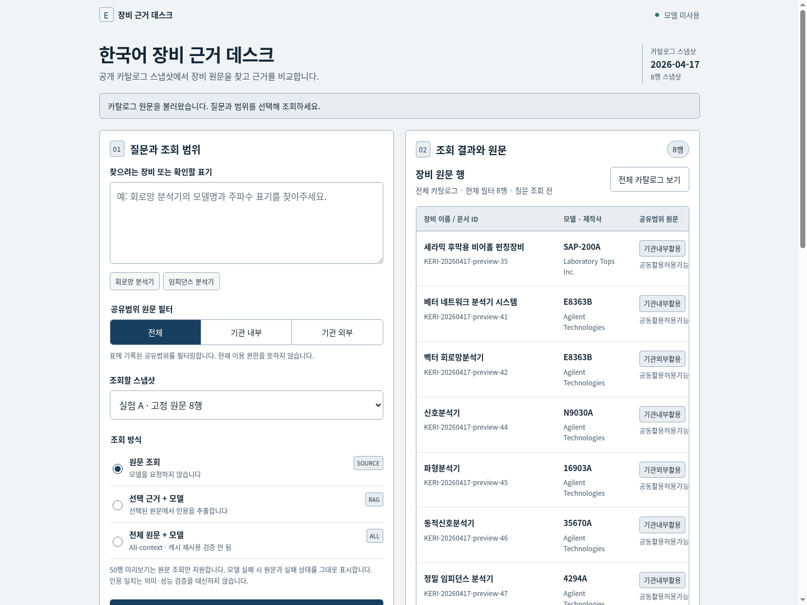

**2. 질의 결과:** E8363B 원문 조회에서 선택된 3개 자료 기록 ID와 확인되지 않은 사항을 보여 줍니다. 방식별 기록 카드는 이 화면 아래에 이어집니다.

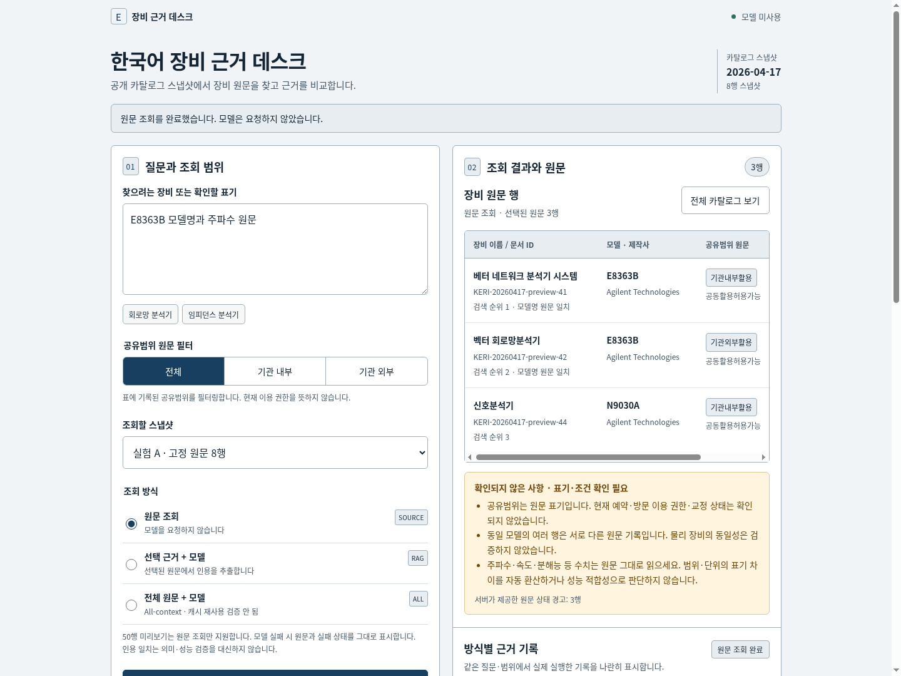

**3. 원문 확인:** 문서 ID, 원문 해시, 원래 필드 문자열을 native 대화상자에서 확인합니다.

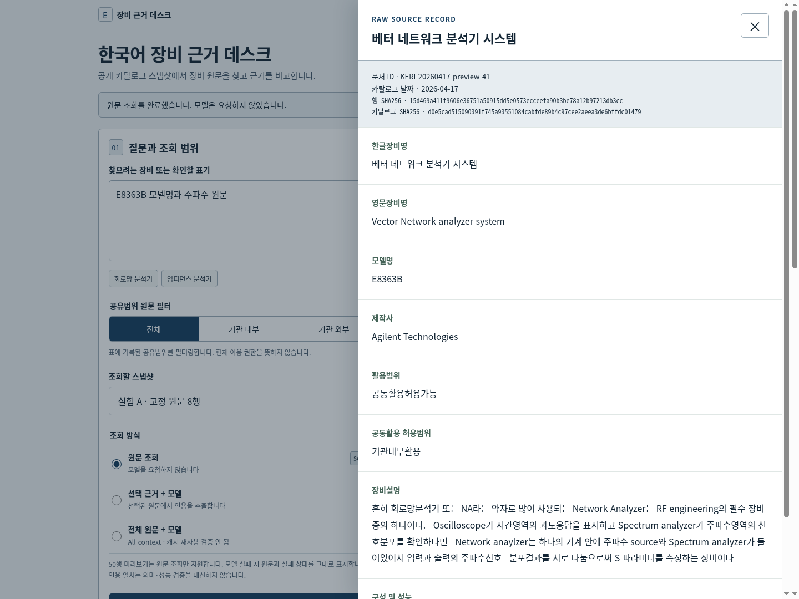

**4. 다른 스냅샷:** 50행 실험 B는 검색 전용으로 유지됩니다.

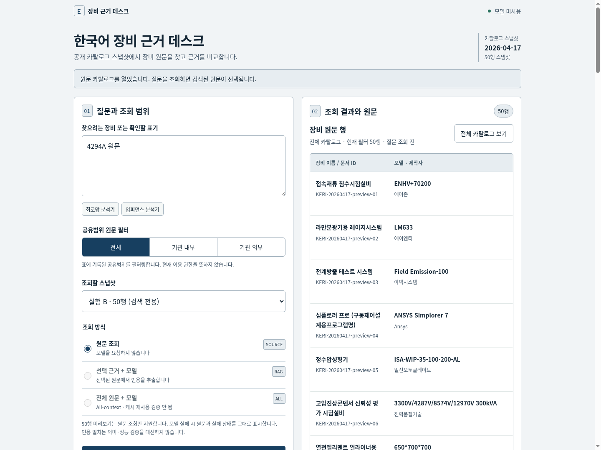

**5. 방식별 상태:** 모델이 꺼진 환경의 RAG·All-context는 원문 후보와 실패 상태를 분리합니다.

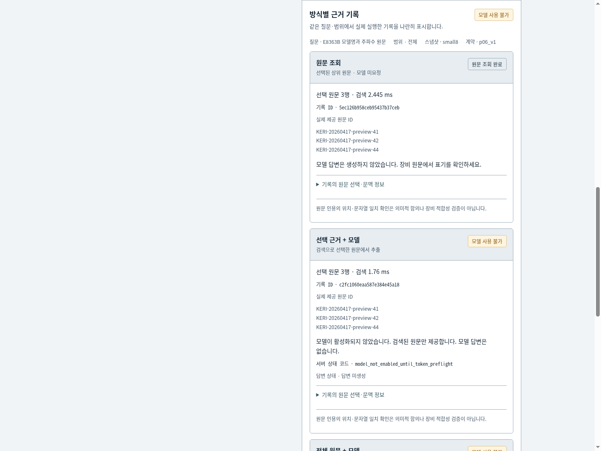

**6. 현재 상태 확인 보류:** 공개 목록에 없는 예약·교정·방문 권한은 모델을 부르지 않고 확인 질문으로 남깁니다.

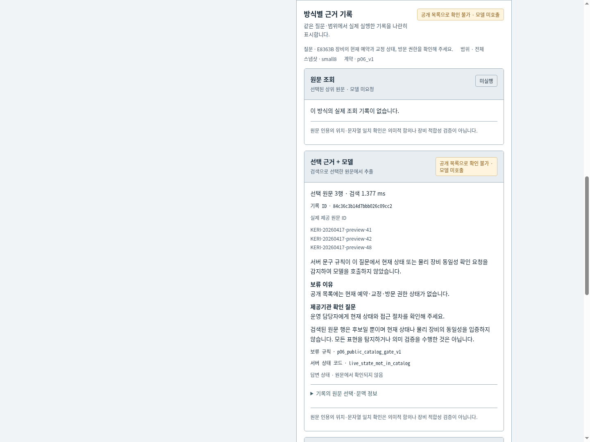

**7. 물리 장비 동일성 보류:** 같은 모델명 행의 물리적 동일성을 입증하지 않습니다.

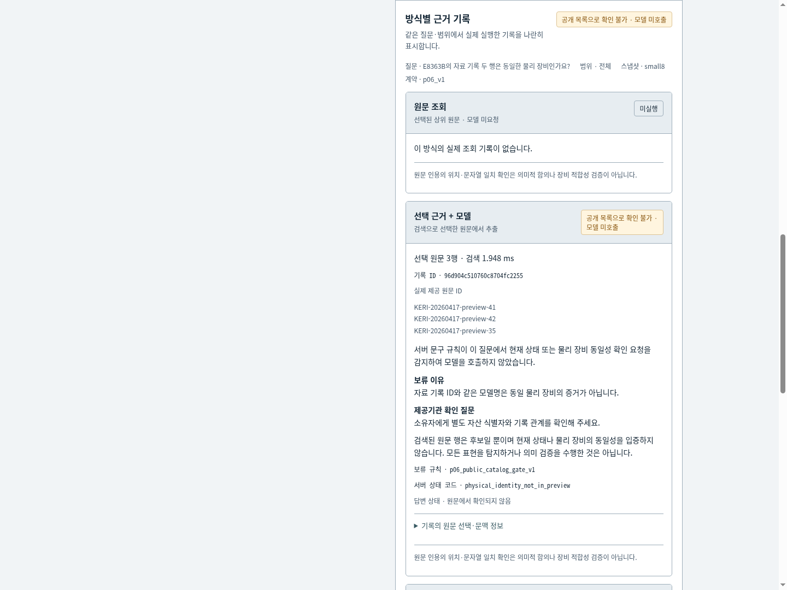

**8. 390px 입력:** 큰 한국어 제목과 기능 컨트롤이 한 화면 폭에 들어갑니다.

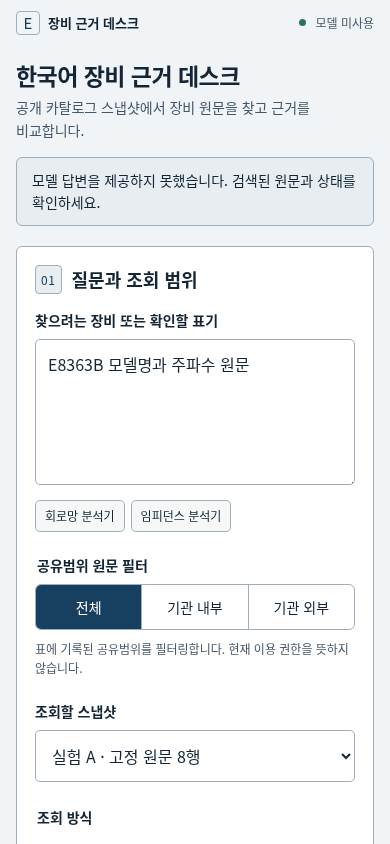

**9. 390px 기록:** 좁은 화면에서는 결과 탭으로 실제 제공 문서 ID와 방식별 상태를 읽습니다.

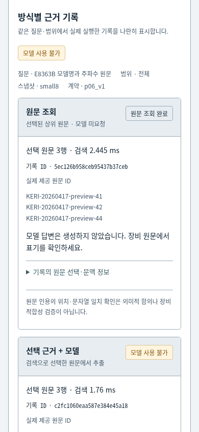

**10. 390px 보류:** 물리 장비 동일성의 미확정 상태를 별도로 표시합니다.

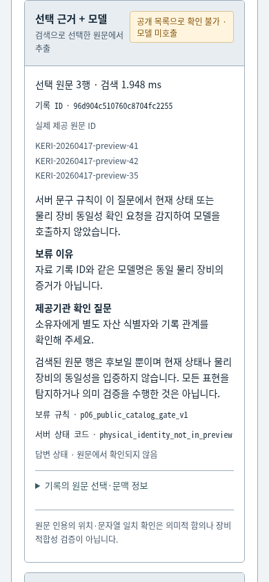

이전 스타일의 [CPU 갤러리](docs/ui/captures/01-source-desktop.png)와 [실제 Qwen 개발 시연 화면·12.04초 영상](docs/ui/actual-model-d1/provenance.md)은 **과거 UI 증거**입니다. D1에서 RAG가 44GHz 원문 문자열을 인용한 사실은 그대로지만, 새 UI에서 모델을 재실행하거나 해당 출력을 재캡처하지 않았습니다. 출처 문자열의 일치가 의미·장비 적합성을 검증한 것은 아닙니다. 이전 [UI 구현 메모](docs/ui/implementation.md)는 원래 검증 범위를 보존합니다.

## 라이선스와 의존 자료

이 저장소의 자체 코드와 문서는 [MIT 라이선스](LICENSE)를 적용합니다. 공개 KERI 미리보기 자료는 저장소 코드 라이선스가 아니라 [원 제공기관의 이용허락범위 고지](https://www.data.go.kr/data/15018891/fileData.do)와 [캡처한 권리 메타데이터](data/source-rights.json)를 따릅니다. 모델 가중치는 이 저장소에 넣지 않았습니다. 개발에 사용한 기존 qwen3:4b의 상위 [Qwen3-4B 모델 카드](https://huggingface.co/Qwen/Qwen3-4B)는 Apache-2.0으로 표기합니다. 설치되는 tokenizers 패키지도 별도의 상위 라이선스와 배포 조건을 확인해야 합니다.

## 한계와 다음 범위

자료는 연간 카탈로그의 제한된 DOM 스냅샷입니다. 현재 장비 상태, 외부 사용자 승인, 교정 유효성, 측정 적합성, 위험 조작 절차를 답으로 보장하지 않습니다. 동일 모델명이나 snapshot row ID만으로 실제 장비 동일성을 확정하지 않습니다. 인용 문자열이 맞아도 수치 의미가 잘못 연결될 수 있습니다.

후속 범위는 사전 고정한 실험의 실제 측정, 별도 신규 질의 평가, 출처와 권리를 확인한 원본 import, 명시적인 이용·교정 확인 절차입니다. 현재 프로젝트 성과로 기업 보고서의 효과나 실제 공장 공수 절감을 가져오지 않습니다.
